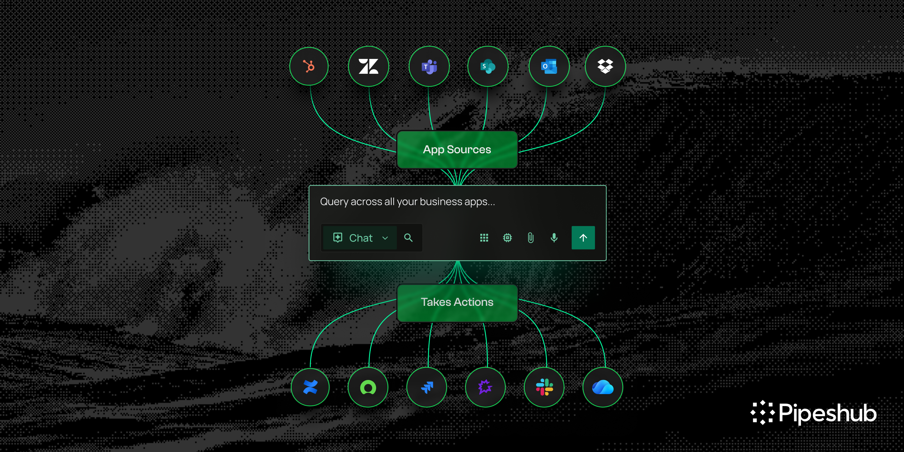

  

**PipesHub is the open-source Context Layer for Enterprise AI. Connect enterprise knowledge across your organization, preserve access permissions, generate trustworthy citations, and build AI agents, enterprise search, RAG applications, MCP servers, and agentic workflows on a single governed context layer.
**

  <a href="https://pipeshub.com">Website</a> |
  <a href="https://docs.pipeshub.com">Docs</a>

